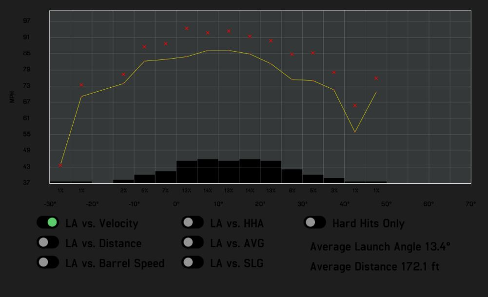

```{r setup, include=FALSE}
knitr::opts_chunk$set(echo = TRUE)
```
    
  Blast Motion and Hittrax are two data collection tools frequently used in amateur and pro baseball. While the Blast Motion sensor captures metrics on swing quality such as Batspeed, Attack Angle, and Time to Contact, Hittrax measures a variety of variables such as Exit Velocity, Launch Angle, Depth of Contact, and Spray Chart. Together, overall trends and tendencies in their data can tell us important information in evaluating a hitter's swing, data that were unable to be quantitatively measured even 10 years ago. I first got a Blast Motion sensor around September 2018, since then, I've employed the sensor on a variety of bats, in a variety of settings, at various times throughout the day, with over 2500 swings logged. Hittrax has been used since 2017 - present, although Hittrax has not always been available for use each time that I've used the Blast Motion Sensor. However, there are still sufficient Hittrax sessions to separate into data for each year of use, including 2019. 
  
  Throughout the process of using these tools, the data has been used mainly to assess individual swings and sessions, answering questions such as "Is my swing speed down today because I worked out right before this?" or "I felt like I squared that ball up. How much did I really do so?".  However, as the season draws near and the practice focus shifts from crafting the best swing possible to doing as much in-game damage with the swing I have, it's time to dig into the data and see what sort of trends arise with the hope that it helps me choose a bat for the upcoming season as well as craft an in-game approach that maximizes my swing pattern and characteristics. 
  
  
    
    
```{r, include = FALSE} 
knitr::opts_chunk$set(echo = FALSE)
library(knitr)
library(dplyr)
library(tidyverse)
library(data.table)
library(ggplot2)

data_metrics <- (read_csv("metrics_2_18.csv"))


averages <- round(matrix(c(mean(data_metrics$Bat.Speed..mph.), 
                     mean(data_metrics$Attack.Angle..deg.), 
                     mean(data_metrics$Time.to.Contact..sec.), 
                     mean(data_metrics$Vertical.Bat.Angle..deg.), 
                     mean(data_metrics$Peak.Hand.Speed..mph.), 
                     mean(data_metrics$Power..kW.), 
                     mean(data_metrics$Blast.Factor)),
                   ncol=7,byrow=TRUE),2)
colnames(averages) <- c("Bat Speed (mph)","Attack Angle (?)",
                        "Time to Contact (sec)",
                        "Vertical Bat Angle (?)",
                        "Peak Hand Speed (mph)",
                        "Power (kW)",
                        "Blast Factor")
rownames(averages) <- c("Averages")
averages <- as.table(averages)

```


### The Rundown:
```{r}
kable(averages)
```

Immediately some things become clear: 

1: I do not have major league batspeed, whose averages are normally around 70 mph. This hurts my draft chances.

2: Despite my little league coaches' best efforts, I do not "swing down", as signified by my positive Attack Angle

3: Nothing particularly jumps out as an especially startling, immediate-fix metric. They all fall around the collegiate averages as stated by Blast Motion. In other words, I have a swing, according to Blast Motion, should give me a decent chance to compete at the NCAA Division 3 level. Especially as the season draws near, this is a good thing. 


###Going Deeper:

Batspeed is measured as the speed of the sweet spot of the bat at time of contact. It also doesn't totally mean much if you can't square up the ball at an optimal angle for hits. Luckily, we have exit velo and launch angle to help. Exit Velo Hittrax data from the 2019 offseason is shown here. For our purposes, I've only included data where I've taken over 10 swings, excluding live AB sessions and practice challenges that are out of our focus for now. In 2019, that includes 5 sessions so far. The error bar in this case reflects max velo between all sessions. 
```{r, include = FALSE}
sessions <- (read_csv("hittrax_sessions.csv"))

sessions$Date <- as.Date(sessions$Date, format="%m/%d/%Y")


```

```{r, include = FALSE}
filtered_sessions <-  sessions %>%
  mutate(year = str_sub(sessions$Date, 1,4)) %>% #gets year from Date column
  filter(AB > 10) %>%
  group_by(year) %>%
  filter(year == 2019)

filtered_2019 <- round(matrix(c(mean(filtered_sessions$AvgV), 
                           max(filtered_sessions$MaxV)),
                         ncol=2,byrow=TRUE), 2)
colnames(filtered_2019) <- c("Average Exit Velo (mph)","Max Exit Velo (mph)")
rownames(filtered_2019) <- c("")
filtered_2019 <- as.table(filtered_2019)

  
```

```{r, include = TRUE}
kable(filtered_2019)
```

In most sessions, I've had an average exit velo around 83 mph, with a max of 94 between all sessions. This alone doesn't tell us much, other than I probably won't be in the major leagues anytime soon, where average exit velo is regularly above 90 mph. So what can we tell? We can first look at this relative to other years so see if there's any noticeable changes. 

```{r, include = FALSE}
sessions_copy <- sessions[-36,]
sessions_copy <- sessions_copy[-35,]
sessions_copy <- sessions_copy[-19,]
  
```

```{r, include = TRUE}
sessions_copy %>%
  mutate(Year = str_sub(sessions_copy$Date, 1,4)) %>% #gets year from Date column
  filter(AB > 10) %>%
  group_by(Year) %>%
   #only in 2019 now
  ggplot(aes(x = Year,
             y = AvgV)) +
  geom_boxplot(aes(fill = Year)) +
  ylab("Average Exit Velo")
```
```{r, include = FALSE}
filtered_sessions <-  sessions_copy %>%
  mutate(Year = str_sub(sessions_copy$Date, 1,4)) %>% #gets year from Date column
  filter(AB > 10) %>%
  group_by(Year) %>%
  summarize(mean.exitVelo = round(mean(AvgV),2), max.exitvelo = max(MaxV))
```
```{r, include = TRUE}
kable(filtered_sessions,
      col.names = c("Year",
        "Average Exit Velo (mph)",
                    "Max Exit Velo (mph)"))
```

On average, I'm hitting the ball harder than I did in 2018, but not that much differently than in 2017, and my max exit velo is lower than in 2018. Are these significantly different? A quick analysis of variance tells us that they were between 2017 and 2018 (ANOVA, TukeyHSD, p < .05), as well as between 2018 and 2019 (ANOVA, Tukey HSD, p < .05), but not between 2017 and 2019. Max exit velo  was not significantly different between years.
```{r, include = FALSE}
sessions_dates <- sessions %>%
  mutate(Year = str_sub(sessions$Date, 1,4)) %>% #gets year from Date column
  filter(AB > 10)

  
anova1<-aov(sessions_dates$AvgV~sessions_dates$Year) 
summary(anova1)
TukeyHSD(anova1)
anova1<-aov(sessions_dates$MaxV~sessions_dates$Year) 
summary(anova1)
TukeyHSD(anova1)
```

So in 2019, I'm hitting the ball relatively similar to how I did in 2017, and harder than I did in 2018. Now that we've established this, we can start to figure out what to do with the information that we have. 

First of all, a ball hit at 94 mph at a 30? Launch Angle travels around 350 feet at sea level (Middlebury is at 427 feet). On the most hitter-friendly of parks, this is rarely leaving the park, even when I do hit it that hard. At a launch angle that high, balls hit around 90 mph turn into long fly outs.  If I'm going to get on base consistently wth my hardest hit balls, it will have to be by hitting balls that don't hang up in the air so long, ie with a shallower launch angle. A ball hit with a 30? Launch Angle is usually a flyball, whereas Line Drives, while poorly defined, are certainly lower. What kinds of balls have I been hitting in my hittrax sessions this year?


```{r, include = FALSE}
legend_names <- c("Line Drives", 
                  "Ground Balls",
                  "Fly Balls")
perc <- sessions %>% #saves summarize resutls in a table
  mutate(Year = str_sub(sessions$Date, 1,4)) %>% #gets year from Date column
  group_by(Year) %>%
  filter(AB > 10, Year == 2019) %>%
  summarize(mean.ld = mean(LD..),
            mean.gb = mean(GB..),
            mean.fb = mean(FB..))
```
```{r, include = TRUE}
perc %>%
  gather(key = "Type", value = "Proportion", -Year) %>% #changes the wide dataset to Long (x, y columns)
  ggplot(aes(x = Year,  
             y = Proportion)) +
  geom_bar(aes(fill = legend_names),
           stat = "identity",
           position = "dodge") +
  theme(legend.title = element_blank()) #gets rid of legend title
```

Lots of line drives! That's always good to have, no matter what your exit velo is. Is this any different than years before?
```{r, include = FALSE}
perc <- sessions %>% #saves summarize resutls in a table
  mutate(Year = str_sub(sessions$Date, 1,4)) %>% #gets year from Date column
  group_by(Year) %>%
  filter(AB > 10) %>%
  summarize(mean.ld = mean(LD..),
            mean.gb = mean(GB..),
            mean.fb = mean(FB..)) 

```
```{r, include = TRUE}
perc <- sessions %>% #saves summarize resutls in a table
  mutate(Year = str_sub(sessions$Date, 1,4)) %>% #gets year from Date column
  group_by(Year) %>%
  filter(AB > 10) %>%
  summarize(mean.ld = mean(LD..),
            mean.gb = mean(GB..),
            mean.fb = mean(FB..)) 

perc %>%
  gather(key = "Type", value = "Proportion", -Year) %>% #changes the wide dataset to Long (x, y columns)
  ggplot(aes(x = Year,  
             y = Proportion)) +
  geom_bar(aes(fill = Type),
           stat = "identity",
           position = "fill") +
  scale_fill_manual(values = c("#F8766D", "#00BA38", "#619CFF"),
                    labels = c("Fly Balls", 
                               "Ground Balls",
                               "Line Drives"), name = "")
```

A quick significance test tells us that Fly Ball percentage is significantly less in 2018 than in 2019 (ANOVA, TukeyHSD, p < .05), but the other percentages are not different from each other.

```{r, include = FALSE}
sessions_dates <- sessions %>% #saves summarize resutls in a table
  mutate(year = str_sub(sessions$Date, 1,4)) %>% #gets year from Date column
  filter(AB > 10)

anova1<-aov(sessions_dates$GB..~sessions_dates$year) #is there an effect of year on gb %?
summary(anova1)
TukeyHSD(anova1)

anova1<-aov(sessions_dates$FB..~sessions_dates$year) #is there an effect of year on fb %?
summary(anova1)
TukeyHSD(anova1)

anova1<-aov(sessions_dates$LD..~sessions_dates$year) #is there an effect of year on ld %?
summary(anova1)
TukeyHSD(anova1)
```

If we assume that most fly balls I hit will be outs at my exit velo, the trend is encouraging. In 2018, BABIP (batting average of balls in play) was .339 in Division 3 baseball, compared to the MLB average of around .300.  then Generally speaking, if I can hit more  balls in play rather than strike out, I'll be more productive as a hitter, especially if those hits are line drives (this we've known since baseball was invented). For me personally, this means that the balls that I mishit should ideally be groundballs rather than fly balls, a mishit being something other than a line drive. 

Many of my flyballs will be lazy outs while my grounders will have a higher chance of being beaten out, especially on fields in New England where the grass is slower. Interestingly, D3 fielding percentages of outfielders vs infielders are fairly similar (96.5% vs 94%), perhaps indicating that the adage "hit ground balls to put pressure on the infield and make them make errors" is not necesarily true. You could seemingly achieve around the same "pressure"" by hitting flyballs as well. However, you've got no chance of beating out a flyball, only a chance of it going over the fence, provided it has enough exit velo. And as shown, I usually do not. Assuming that 12 stolen bases last year indicates I have at least a bit of speed, groundballs are a mishit preferable to a flyball for me. 


Is my swing conducive to hitting line drives, with my mishits as ground balls? Another way to look at this is, at which angles do I hit the ball the hardest? Launch angle and Attack Angle can be helpful here. If we remember, my Attack Angle on average slopes uphill ~9? to meet the plane of the pitch.However, it makes sense that Attack Angle varies somewhat, depending on factors like pitch location, pitch type, and approach. Am I just uppercutting all pitches low in the zone and flattening out my barrel on high pitches, or is my barrel always on the same plane? Assuming that I've seen a sufficient variety of pitch locations throughout Blast Motion data collection, how close are all my swings to 9?? 
```{r, include = TRUE}
data_metrics %>%
  ggplot(aes(x = data_metrics$Attack.Angle..deg 
             )) +
  geom_density() +
  xlab("Attack Angle") +
  ylab("Density")
```

Attack angle is seemingly normally distributed, with most of my swings have an attack angle between 5? - 15?. If mishits are balls not barrelled up,  we would expect to see lower exit velos at Launch Angles outside the range of 5?- 15. In other words, my hardest hit balls barelled up with all 63 mph of my batspeed should match the plane of my attack angle, since that's the plane that my barrel is coming through.

Is there any way to check this? Hittrax! 




If we can look past the darkness of the Hittrax report, we can hopefully see that my hardest hit balls generally occur between 5? - 15?, right in the range where we would predict. In this range, not only are my hardest hit balls line drives, but my higher-LA mishits are more likely to be bloop singles that don't have enough exit velo to reach an outfielder, and lower-LA mishits hit < 5? LA are ground balls. Great! Right where we want them to be for the upcoming season. 

Leaving for a moment the fact that we don't know exactly where on the field these balls are being hit, we can assume that based on my Batspeed, Exit Velo, Launch Angle and Attack Angle, I've got myself a reasonable swing and approach to employ for the upcoming season. Now the question is: which bat do I use? 

Let's look at bats that I used with a blast motion sensor between September 2018-earlier this month that each have at least 90 swings on them. This eliminates bats that I've used only a few times to test out how they feel, and other teammates' sessions that have just used the sensor to try it out for a session or two. Each of the remaining bats I wouldn't have used so frequently if they didn't pass my first test, simply liking the way they feel. Two bats, the Zinger Brand bats, are wood bats that I used over Christmas break and so will definitely not be used this season. They're included in this analysis nonetheless just for fun, to see how they compare. This leaves us with four bats, all 33 inches 30 oz, frequently used this offseason to be potentially used in-season:

* Axe Avenge bat from 2017

* Axe Avenge bat from 2019

* Louisville 2019 Prime

* Rawlings Velo BBCOR


Let's look at some important metrics. How about batspeed? Are there differences?

```{r, include = TRUE}
data_metrics %>%
  group_by(Equipment) %>%
  summarize(mean.batspeed = mean(Bat.Speed..mph.), n_swings = n(), sd.batspeed = sd(Bat.Speed..mph.)) %>% #gets number of swings per bat
  filter(n_swings > 90) %>% #
  ggplot(mapping = aes(x = Equipment,
                       y = mean.batspeed)) +
  geom_col(aes(fill = Equipment)) +
  geom_errorbar(aes(ymin = mean.batspeed - sd.batspeed, ymax = mean.batspeed + sd.batspeed)) +
  theme(axis.text.x = element_text(angle = 90, hjust = 1)) +
  xlab("Bat Type") +
  ylab("Average Batspeed") +
  theme(legend.title = element_blank())
#can also just fkip text 45 degrres

```

Error bars reflect standard deviation.
 
```{r, include = FALSE}
filtered_bats <- data_metrics %>%
  group_by(Equipment) %>%
  mutate(n_swings = n()) %>% #gets number of swings per bat
  filter(n_swings > 90) %>%
  group_by(Equipment) %>%
  summarize(mean.batspeed = round(mean(Bat.Speed..mph.),2))


  

```
```{r, include = TRUE}


kable(filtered_bats,
      col.names = c("Bat Type",
        "Average Bat Speed (mph)"))
```

There are some differences here. Significant differences were found between all bats except between the Lousville and Rawlings, The Zinger X10 and the Rawlings, and the Lousiville and the Zinger X10. (ANOVA, TukeyHSD, p <.05). 

What other important stats could we look at? How about Attack Angle?

Error bars reflect standard deviation.
```{r, include = TRUE}
filtered_bats <- data_metrics %>%
  group_by(Equipment) %>%
  mutate(n_swings = n()) %>% #gets number of swings per bat
  filter(n_swings > 90)

```
```{r, include = TRUE}
filtered_bats %>%
  ggplot(aes(x = Attack.Angle..deg.)) +
  geom_density(aes(fill = Equipment), alpha = .2) +
  xlab("Attack Angle") +
  ylab("Density") +
  theme(legend.title = element_blank())
  
```

Predictably, most attack angles are around 10?, and the majority of the variance falls between 5?- 15?. With such a variance, is there still differences between them?

The Axe Avenge 2019 had a significantly higher angle than all other bats. The Louisville was significantly lower than the Axe Avenge 2017 bat as well (ANOVA, TukeyHSD, p <.05).  

Time to contact also seems important. This variable is measured on the sensor as the elapsed time between start of downswing and impact.

```{r, include = TRUE}
data_metrics %>%
  group_by(Equipment) %>%
  summarize(mean.Time_to_Contact = mean(Time.to.Contact..sec.), n_swings = n(), sd.Time_to_Contact = sd(Time.to.Contact..sec.)) %>%#gets number of swings per bat
  filter(n_swings > 90) %>%
  ggplot(mapping = aes(x = Equipment,
                     y = mean.Time_to_Contact)) +
  geom_col(aes(fill = Equipment)) +
  geom_errorbar(aes(ymin = mean.Time_to_Contact - sd.Time_to_Contact, ymax = mean.Time_to_Contact + sd.Time_to_Contact)) +
  theme(axis.text.x = element_text(angle = 90, hjust = 1)) +
  xlab("Bat Type") +
  ylab("Time to Contact") +
  theme(legend.title = element_blank())
```

Are there differences? Definitely! All bats were significantly different from each other except for between the Axe bats, the Rawlings and the Louisville, and the Zinger bats (ANOVA, TukeyHSD, p <.05). Interestingly, whether the time to contact was different can be summarized here by what type of bat it was: a normal-handled BBCOR, Axe-handled BBCOR, or normal-handled wood bat. 


###Discussion
So what does this all mean? Well, in terms of time to contact, there are certainly significant differences, but do they matter that much? The fastest average time to contact, the Axe Avenge 2019, averaged .130 seconds, while the slowest bat, the wooden Zinger x10, averaged .149 seconds. When a 95 mph pitch takes .425-.450 seconds to reach the plate and it can take at least .250 seconds to react to the pitch, a few milliseconds can make *all* the difference in whether you square a ball up or not.


Batspeed seems a bit more cut and dry. Generally speaking, a 1mph increase in bat speed equates to 1.2 MPH of EV if we hit the ball at the sweet spot. So, 3mph increase in bat speed is an extra 15-20ft of distance on a ball at 30 degree Launch Angle, the optimal LA for distance. Also worth considering is the benefits that a higher batspeed can give you regarding timing. If you're not on time, you'll still be able to hit the ball hard if you've got a higher batspeed generally than someone with a lower batspeed. The Axe Avenge 2019 model took this category as well, with an average batspeed of 66.4 mph, in contrast to the Zinger X318 Bat, with had an average speed of 60.6 mph. A drastic difference!

Most bats weren't different from each other in terms of Attack Angle, with the exception of the Axe Avenge 2019, which averaged 13.2?, significantly higher than all other bats and higher than the average Launch angle by about 4?. It also had the second-lowest variance of the group, with a standard deviation of 5.26?. The implication here is that my hard-hit balls will be at a higher launch angle than the others. This means more balls going farther, more balls over the infielder's heads, but also a bit more hang time, and closer to the outfielders. Although this may warrant further investigation, a more important question is whether or not 4? of Launch Angle is worth a large worry this close to the season, and especially when it is still within an optimal 5?-15? range. The most important takeaway from the Attack Angle Data at this time is that there wasn't a bat that took me outside of this range.

One thing worth thinking about is how exactly this data was collected. Most of whether or not I chose a bat for a given day was based only on its availability, so there was no real pattern to its collection. Additionally, there are a fair amount of variability of the types of swings mixed in. Although I tried to collect as much data while facing a higher velo pitching machine, there are still lots of swings from off a tee or front toss, potentially increasing time to contact and attack angle as well. This is especially prevalent with the Zinger Bats, when I took more tee sessions when I couldn't get anyone to throw to me or feed the machine. Amongsth the bats actually up fhave probably evened out due to the high number of swings taken on each bat.

Additionally, there are other Blast metrics that we could go into: Rotation, Plane, and Connection Scores, Blast Factor, Vertical Bat angle...but for now it's best to keep it simple. The three metrics examined are inarguably important metrics that correlate with a robust swing. Of course, there's so much more to hitting than that: mental game, approach, squaring the ball up consistently, etc. These metrics are only a small piece of the equation, but they're an important one. 

With all this in mind, which bat would I choose? 
Most likely...

####The Axe Avenge 2019 Model!

The batspeed is signifantly highest of the models chosen, it's within my ideal range of attack angle, and it also had the lowest time to contact. We've found a bat for the season! 

Additionally, we'we can form found my approach based on exit velo, attack, and launch angles: hitting line drives over the infielders' heads. Using speed to take my chances on beating out mishit groundballs, and turning doubles into triples on harder hit balls in the gaps. Now the only thing left is to execute it. 


###Notes
We've only really started to break the surface on a lot of these metrics. Further investigation would include beginning to really put Hittrax and Blast together by syncing up Blast and Hittrax swings, helping to answer questions such as: 

* At what swing speeds do I barrell up the most balls, and how hard are they hit?
* What does the variance between max and average exit velo tell us about how well I square up the ball, and how can we use swing speed to improve it?
* At which swing speeds, points of contact, and pitch locations do I hit baseballs to each field?
* How much does swing depth and barrel path affect exit velo and time to contact?

Additionally, we can dig further into Blast Motion Metrics, looking at questions including:

* How does each swing variable correlate with one another, and to exit velo and launch angle?
* What sort of metrics really go into Blast Factor?
* Can you use a "speed efficiency" metric between batspeed and peak handspeed in order to measure kinematic efficiency/proper sequencing?

Each answer can give us an even further understanding of our swing, swing approach, and training methods that can be subsequently improved for more optimal on-field performance. 
Thank you for reading!

*Statistics for D3 and exit velo/Launch Angle data were found at sabermetrics.cs.illinois.edu*                       

